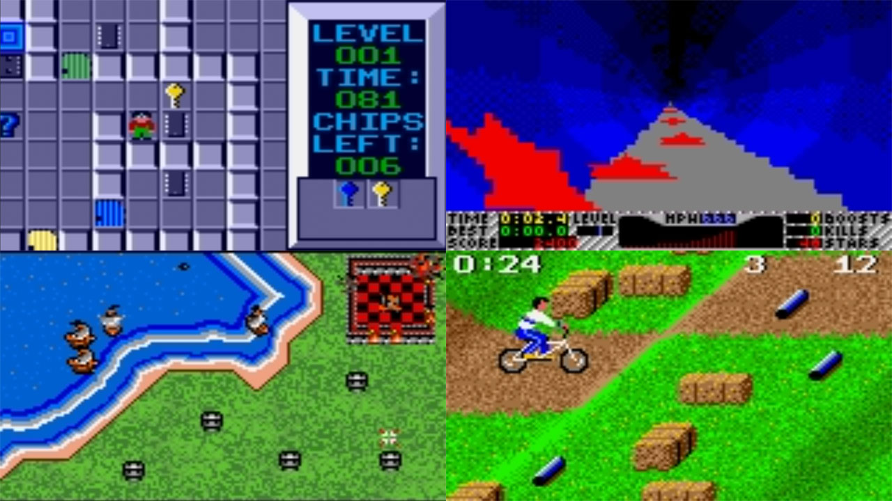
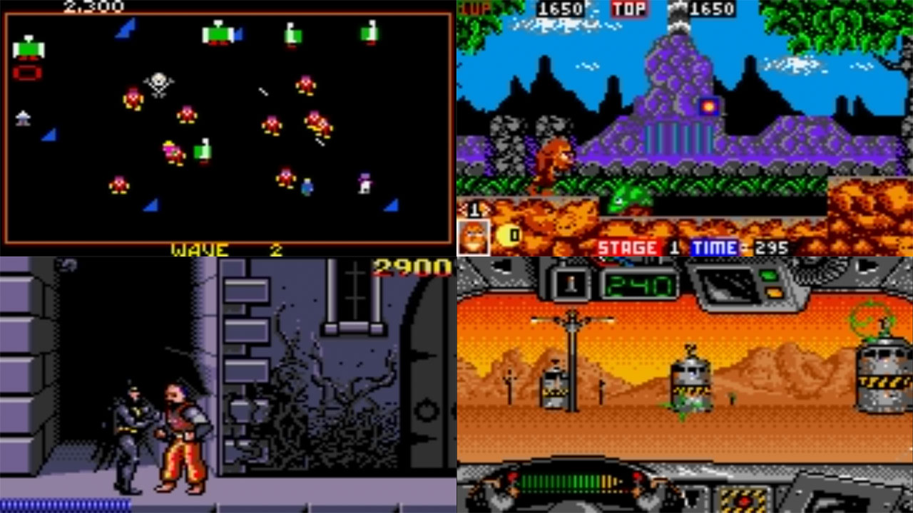

# Atari - Lynx (Beetle Lynx)

### Description

Beetle Lynx is the Atari Lynx module of Beetle, a fork of Mednafen. The Mednafen module is a fork of Handy.

### License

Zlib|GPLv2

### Icon

### Fanart

Help make me fanart!

### Screenshots

